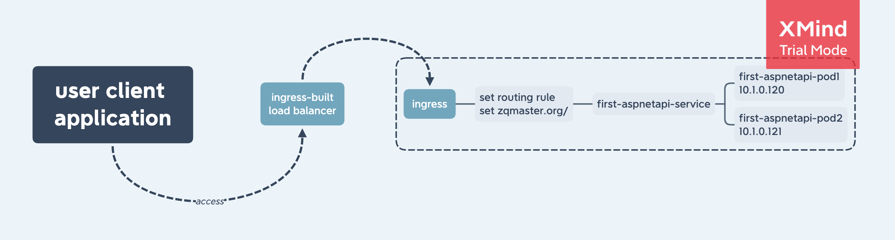
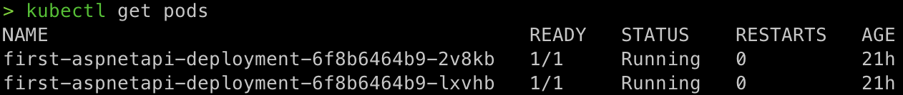
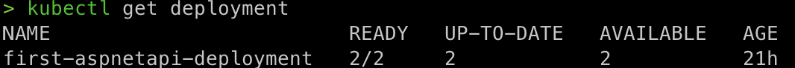
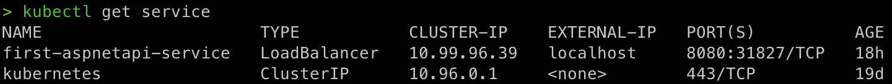
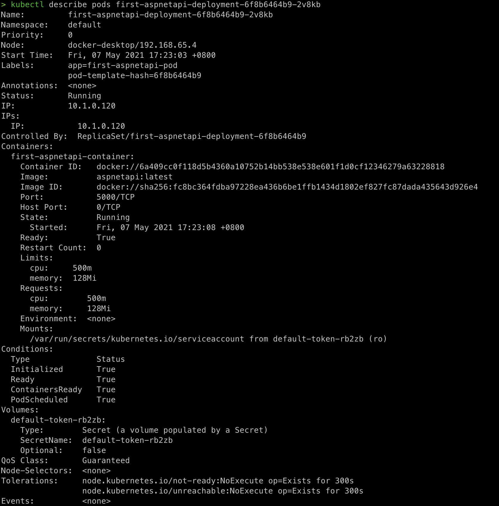
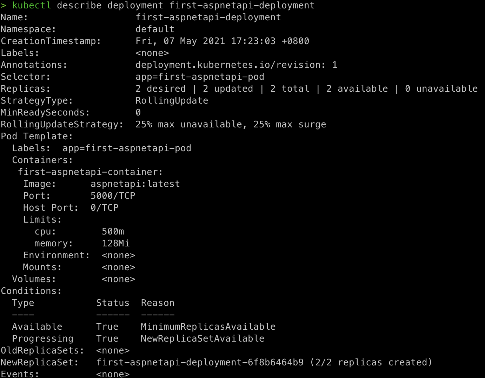
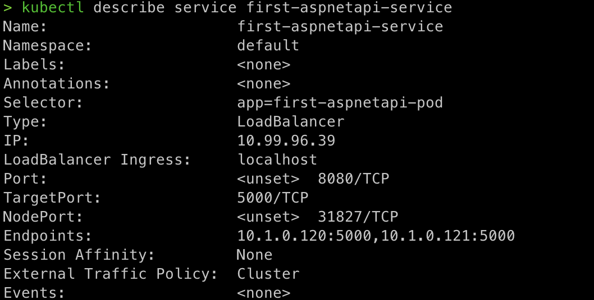
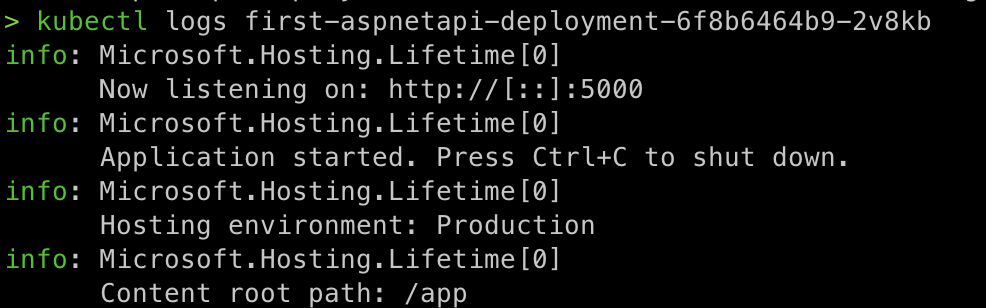

# zengqiang.fang-week2

## kubernetes training

### 预装环境

* #### docker desk

* #### enable kubernetes

* #### brew install kubectl

### 启动 local k8s中部署的service

* #### kubectl apply -f deployment.yaml

* #### kubectl apply -f service.yaml

* #### kubectl apply -f ingress.yaml

* #### 使用docker desktop提供的kubernetes环境，需要加装一个ingress controller

    kubectl apply -f https://raw.githubusercontent.com/kubernetes/ingress-nginx/controller-v0.46.0/deploy/static/provider/cloud/deploy.yaml

* #### input http://zqmaster.org/swagger/index to play with k8s

### the architecture of this application

### 常用命令总结

* #### **kubectl logs**: Print the logs for a container in a pod or specified resource. If the pod has only one container, the container name is optional

* #### **kubectl describe**: Show details of a specific resource or group of resources Print a detailed description of the selected resources, including related resources such as events or controllers. You may select a single object by name, all objects of that type, provide a name prefix, or label selector

* #### **kubectl apply**: Apply a configuration to a resource by filename or stdin. The resource name must be specified. This resource will be created if it doesn't exist yet. To use 'apply', always create the resource initially with either 'apply' or 'create --save-config' (JSON and YAML formats are accepted)

* #### **kubectl delete**: Delete resources by filenames, stdin, resources and names, or by resources and label selector. JSON and YAML formats are accepted. Only one type of the arguments may be specified: filenames, resources and names, or resources and label selector

### 常用概念

- Pod: 最小的部署单元

- Node: 一个虚拟或者物理的节点

- Deployment: 管理pod

- Service: 实现服务发现与负载均衡，并实现应用的零宕机升级

- Ingress: 实现服务的对外暴露，管理service

- ReplicaSet: 用来确保容器应用的副本数始终保持在用户定义的副本数，即如果有容器异常退出，会自动创建新的 Pod 来替代,典型应用场景包括确保健康 Pod 的数量、弹性伸缩、滚动升级以及应用多版本发布跟踪等

- Namespace: 管理全部的内部资源，对内部资源进行归类

### kubectl cronjob

* #### kubectl apply -f Jobs.yaml

* #### kubectl get job --watch

* #### kubectl delete -f Jobs.yaml

* #### some issues noted:  **如果直接使用k8s官网提供的demo, 其中的api version会不满足，可以使用 kubectl apiversion查看能够使用的版本**

### aspnetapi kubectl get/describe

* #### kubectl get pod

* #### kubectl get deployment

* #### kubectl get service

* #### kubectl describe pod

* #### kubectl describe deployment

* #### kubectl describe service

* #### kubectl logs [pods name]

